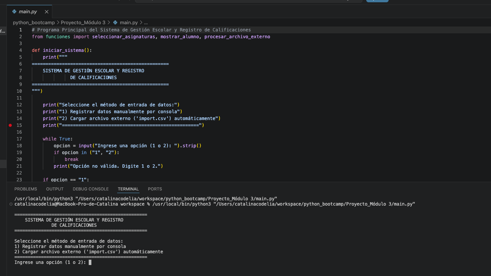
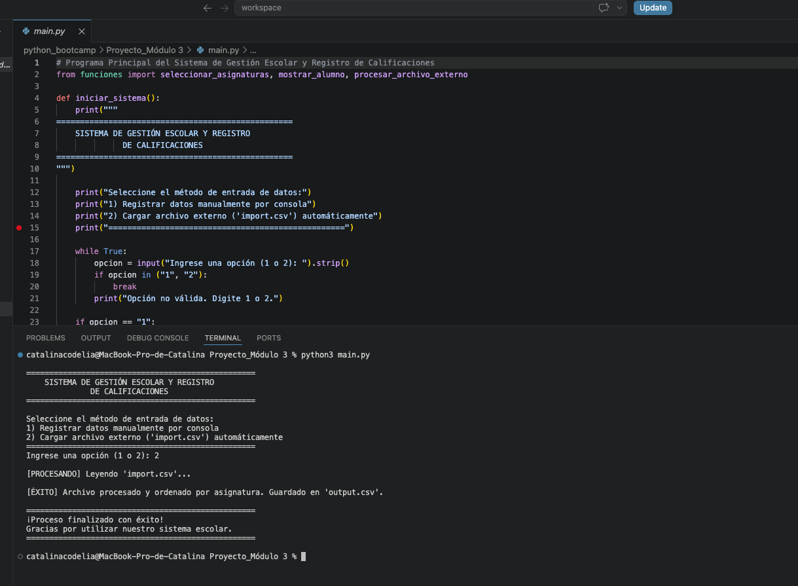
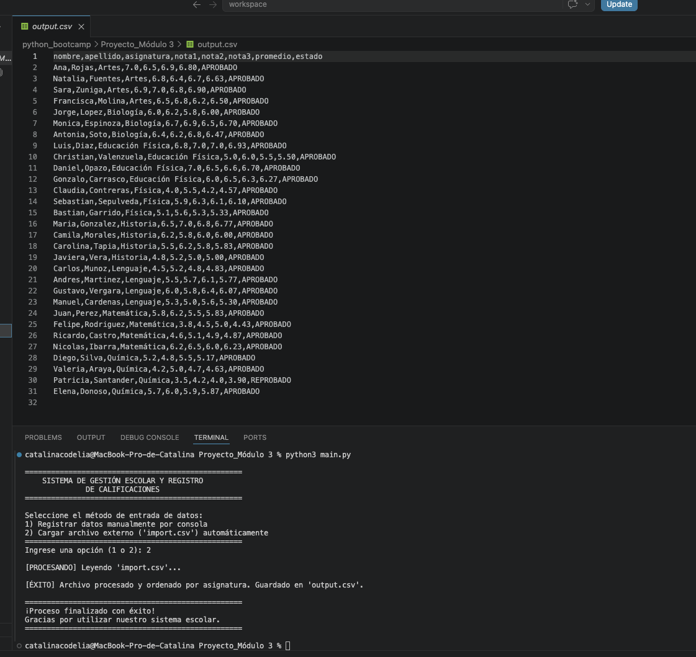

# INFORME DE VALIDACIÓN Y BITÁCORA DE DESARROLLO DEL PROYECTO SISTEMA DE GESTIÓN ESCOLAR Y REGISTRO DE CALIFICACIONES

---

## 1. Introducción

Este informe explica el diseño y prueba del proyecto **Sistema de Gestión Escolar y Registro de Calificaciones**, que tiene como objetivo principal crear una aplicación que funcione de dos maneras diferentes según lo que elija el usuario:
1. **Ingreso manual:** Escribir los datos de los alumnos y sus notas directamente en la consola.
2. **Carga automática:** Leer un archivo con datos ya listos (`import.csv`), calcular todo automáticamente y guardarlo ordenado en un nuevo archivo (`output.csv`).

El enfoque principal fue hacer un código ordenado, que no se caiga si el usuario comete un error al tipear y que procese los archivos de forma limpia.

---

## 2. Bitácora de Desarrollo

 El código se separó en tres archivos (módulos) para que sea más fácil de mantener y entender:

*   **`utilidades.py`:** Contiene las funciones que validan que las notas estén entre 1.0 y 7.0, y una función recursiva para sumar las notas.
*   **`funciones.py`:** Este archivo se encarga de armar los menús de las asignaturas, revisar que no se repitan materias usando conjuntos (`set`) y hacer todo el proceso de leer, procesar y guardar los archivos CSV.
*   **`main.py` :** Es el punto de partida y, al ejecutarlo, le pregunta al usuario si quiere trabajar a mano (Opción 1) o procesar el archivo automático (Opción 2).

### El desafío del ordenamiento
Para el archivo automático, los alumnos son agrupados por asignatura. Para lograrlo, el sistema toma los datos extraídos del CSV y los ordena alfabéticamente por la columna `asignatura` justo antes de crear el archivo final de salida.

---

## 3. Pruebas de Funcionamiento

El manejo de los errores pra los archivos ingresados se trabajó mediante excepciones de archivos existentes (FileNotFoundError) o mediante control de formato (IOError).

*   **Prueba de números:** Si el sistema pide la cantidad de alumnos e ingreso letras (como "tres"), el programa avisa del error y vuelve a preguntar sin cerrarse.
*   **Prueba de materias repetidas:** Si intento agregar "Química" dos veces al mismo alumno, el sistema lo detecta y me dice que esa asignatura ya fue ingresada.
*   **Prueba de archivo vacío o inexistente:** Si el archivo `import.csv` no está en la carpeta, el programa muestra un mensaje controlado en pantalla en lugar de lanzar un error crítico de Python.
*   **Prueba de notas:** Si pongo un 8.0, el sistema me recuerda que la nota máxima es 7.0 y me pide ingresarla otra vez.

---

## 4. Guía para Evidencias (Capturas de Pantalla)

*En estas secciones pegaré las fotos de mi terminal para demostrar que el código funciona:*

### 📸 Captura 1: El Menú Inicial
> Captura de pantalla que muestra las dos opciones del sistema al arrancar `main.py` (Manual o Automática).

### 📸 Captura 2: Procesamiento del CSV
> Captura que muestra el mensaje de éxito en la terminal tras elegir la Opción 2: `[ÉXITO] Archivo procesado y ordenado por asignatura. Guardado en 'output.csv'`.

### 📸 Captura 3: El Archivo Creado (`output.csv`)
> Captura del archivo final abierto, mostrando las columnas de `promedio` y `estado` (APROBADO/REPROBADO) calculadas correctamente y las filas agrupadas por materia.

---

## 5. Problemas Encontrados y Soluciones

Durante el desarrollo me topé con dos problemas principales que logré resolver:

1.  **La fila de títulos se movía:** Al ordenar el archivo CSV por asignatura, la palabra "asignatura" (la cabecera) se mezclaba con los datos de los alumnos. lo arreglé separando la primera línea antes de ordenar y escribiéndola fija al principio del archivo de salida.
2.  **Muchos decimales en las notas:** Los promedios salían con muchos números (ej. `5.33333333`). Lo solucioné aplicando un formato de texto en Python (`:.2f`) para forzar a que siempre muestre solo dos decimales.

---

## 6. Conclusión

Este proyecto me ayudó a entender en la práctica cómo conectar diferentes archivos en Python, cómo tratar con archivos externos (`.csv`) y la importancia de validar lo que el usuario escribe. El sistema funciona de forma interactiva y automática, cumpliendo con los objetivos planteados en el bootcamp.